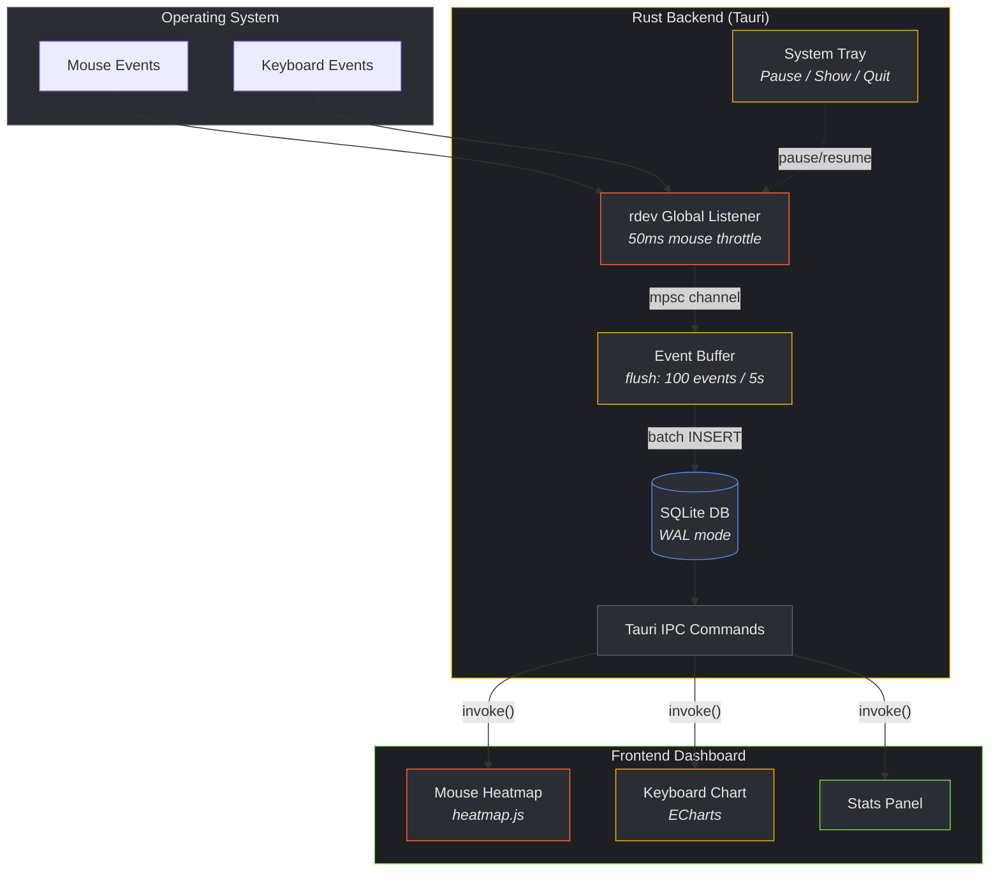
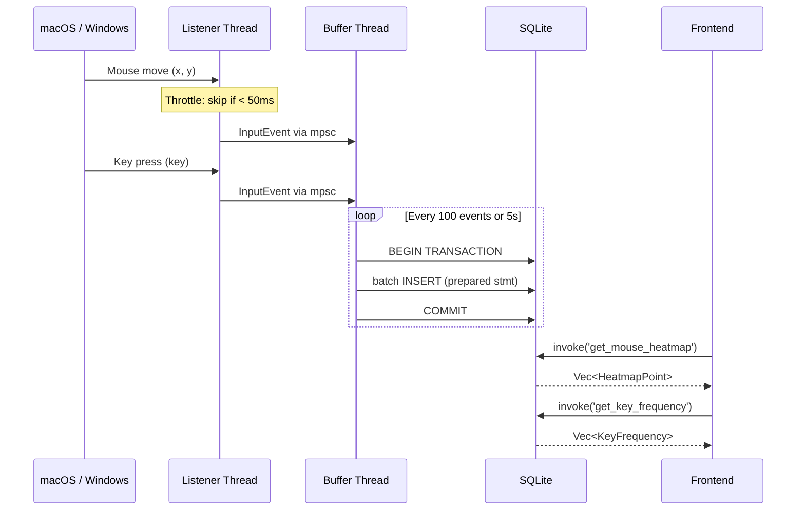
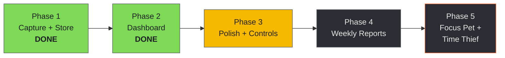

# ClickGlow

A privacy-first keyboard & mouse heatmap generator for your desktop. Runs silently in the background, records your input activity locally, and generates beautiful heatmaps and frequency charts.

**All data stays on your machine. Zero network. Zero telemetry.**

## Features

- **Mouse Heatmap** - See where you click and hover most on screen
- **Keyboard Frequency Chart** - Discover your most-used keys
- **Daily/Weekly Reports** - Auto-generated usage summaries
- **System Tray** - Runs quietly in the background
- **Cross-platform** - macOS, Windows, Linux

## Tech Stack

| Layer | Technology |
|-------|-----------|
| Backend | Rust + Tauri v2 |
| Input Capture | `rdev` (global listener) |
| Storage | SQLite via `rusqlite` (WAL mode) |
| Frontend | Vanilla JS + `heatmap.js` + `ECharts` |
| System Tray | Tauri built-in tray API |

## Architecture



### Event Flow



### Product Roadmap



## Project Structure

```
ClickGlow/
├── src-tauri/
│   ├── src/
│   │   ├── main.rs              # Entry point
│   │   ├── lib.rs               # Module declarations
│   │   ├── commands.rs          # Tauri IPC handlers
│   │   ├── state.rs             # App state (DB, listener controls)
│   │   ├── input/
│   │   │   ├── listener.rs      # rdev global listener
│   │   │   └── buffer.rs        # Event batching (100 events / 5s)
│   │   ├── db/
│   │   │   ├── connection.rs    # SQLite connection (WAL mode)
│   │   │   ├── schema.rs        # Migrations
│   │   │   └── queries.rs       # Insert/select/aggregate
│   │   ├── tray/                # System tray setup & menu
│   │   └── reporting/           # Weekly report scheduler
│   └── migrations/
│       └── 001_initial.sql
├── src/                         # Web frontend (vanilla JS)
│   ├── index.html
│   ├── css/styles.css
│   └── js/
│       ├── main.js              # App init, Tauri IPC
│       ├── heatmap.js           # Mouse heatmap (heatmap.js lib)
│       ├── keyboard-chart.js    # Key frequency (ECharts)
│       └── dashboard.js         # Dashboard orchestration
├── docs/
│   └── todo.md
└── README.md
```

## Data Schema

```sql
-- Mouse events (moves + clicks)
CREATE TABLE mouse_events (
    id          INTEGER PRIMARY KEY AUTOINCREMENT,
    event_type  INTEGER NOT NULL,  -- 0=move, 1=left, 2=right, 3=middle
    x           REAL NOT NULL,
    y           REAL NOT NULL,
    screen_w    INTEGER NOT NULL,
    screen_h    INTEGER NOT NULL,
    created_at  INTEGER NOT NULL   -- unix ms
);

-- Keyboard events (key-down only)
CREATE TABLE key_events (
    id          INTEGER PRIMARY KEY AUTOINCREMENT,
    key_code    TEXT NOT NULL,      -- e.g. "KeyA", "Space", "ShiftLeft"
    created_at  INTEGER NOT NULL   -- unix ms
);
```

## Prerequisites

- [Rust](https://rustup.rs/) (stable)
- [Tauri v2 CLI](https://v2.tauri.app/start/prerequisites/)
- macOS: Grant **Accessibility** permission when prompted (System Settings > Privacy & Security > Accessibility)

## Development

```bash
# Install Tauri CLI
cargo install create-tauri-app --locked

# Scaffold project (run from parent directory)
cargo create-tauri-app

# Dev mode
cargo tauri dev

# Build release
cargo tauri build
```

## Privacy

ClickGlow stores all data in a local SQLite file (`~/.clickglow/data.db`). No data is ever transmitted over the network. No analytics. No telemetry. Your keystrokes and mouse data never leave your machine.

## License

MIT
