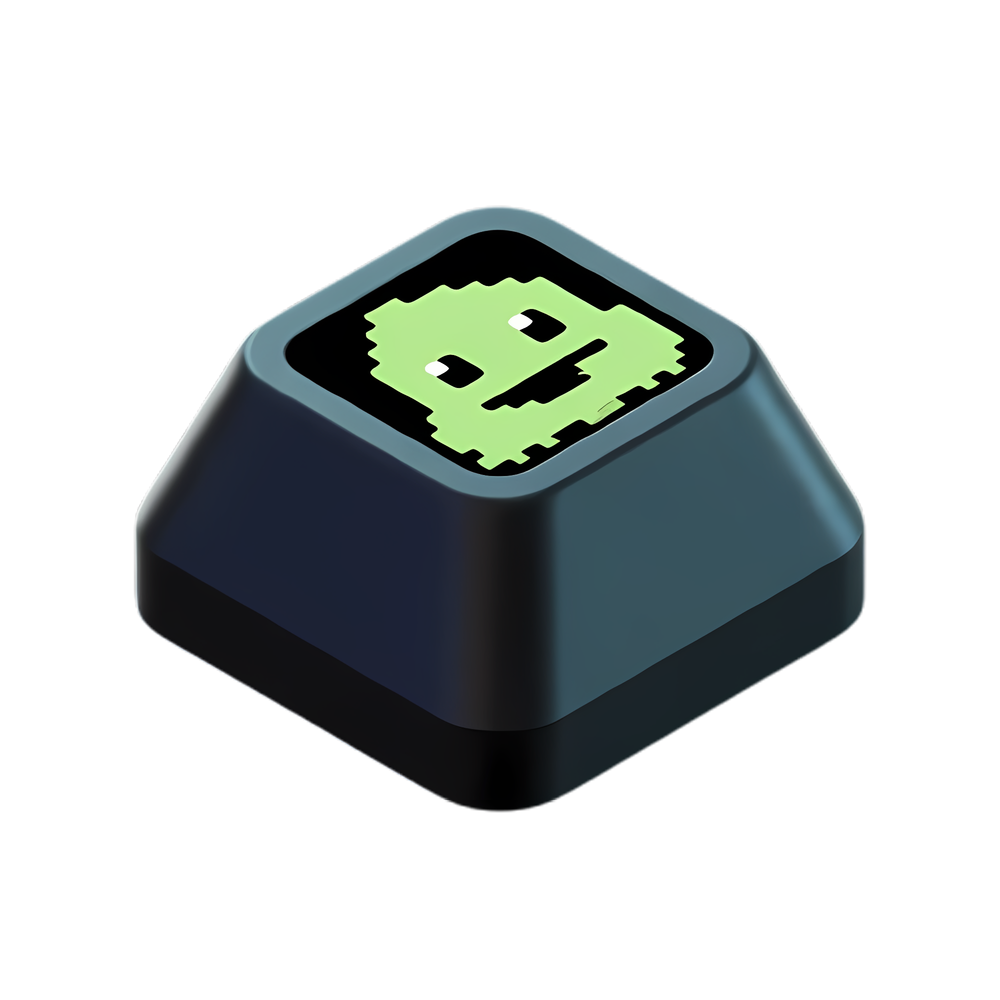
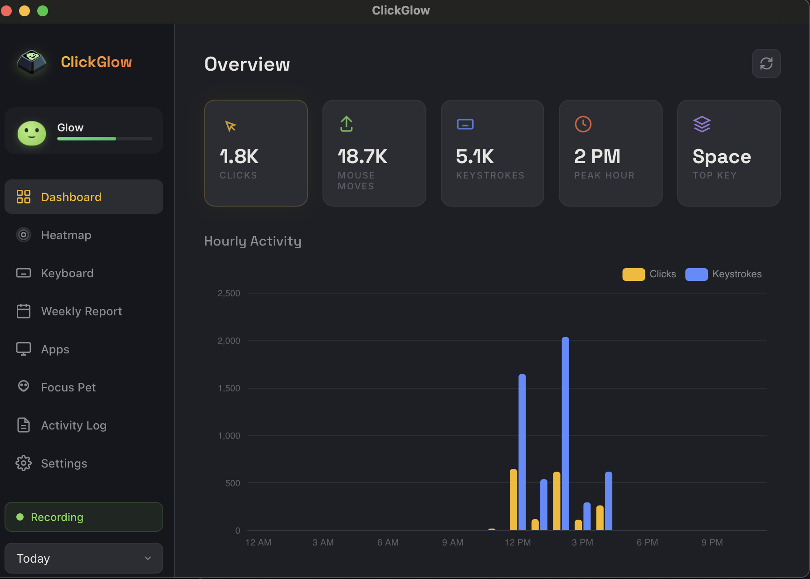
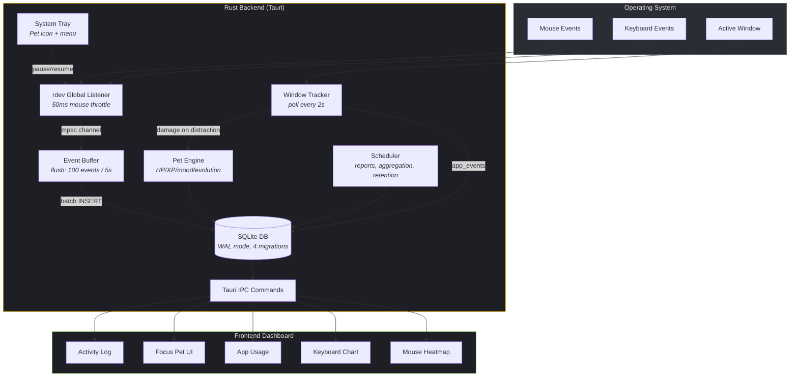

<p align="center">
  
</p>

<h1 align="center">ClickGlow</h1>

<p align="center">A <b>Digital Life Simulator</b> disguised as a productivity app.<br/>Track your keyboard, mouse, and app usage — with a virtual pet that thrives when you focus and suffers when you get distracted.</p>

<p align="center"><b>All data stays on your machine. Zero network. Zero telemetry.</b></p>

<p align="center">
  
</p>

## Features

### Input Tracking
- **Mouse Heatmap** — See where you click and hover most on screen
- **Keyboard Frequency Chart** — Discover your most-used keys
- **Daily Stats** — Clicks, keystrokes, peak hour, hourly activity breakdown

### App Usage & Focus
- **Active Window Tracking** — Detects which app/website you're using via window title
- **Category System** — Apps classified as productive / neutral / distraction
- **Customizable Rules** — Change any app or keyword's category (YouTuber? Mark YouTube as productive!)
- **Activity Log** — Full history of app usage with time, duration, and category

### Focus Pet (Tamagotchi x Productivity)
- **Virtual Pet** — CSS-animated creature that lives in your sidebar and menu bar
- **HP / XP / Level** — Complete Pomodoros to heal and gain XP; distractions deal damage
- **Evolution** — Lv1 Slime -> Lv2 Dragon (100 XP) -> Lv3 Wizard (300 XP)
- **Mood States** — Happy (HP>70), Idle, Angry (HP<30), Sleeping (HP=0)
- **Real-Time Reactions** — Pet shakes, glows red, and roasts you when you visit YouTube
- **Pomodoro Timer** — Configurable duration (15-120 min), feeds pet on completion
- **Menu Bar Icon** — Cute slime icon that changes mood in your macOS menu bar

### Time Thief
- **WANTED Poster** — Western-style poster showing your top time-wasting app
- **Export as PNG** — Save the poster to Downloads

### Reports & Settings
- **Weekly Reports** — Auto-generated every Monday with charts and stats
- **PNG Export** — Save heatmaps and posters
- **Data Retention** — Auto-delete old data (configurable)
- **Auto-Start** — Launch on login via macOS LaunchAgent
- **Onboarding Wizard** — Guides new users through Accessibility permission setup

## Tech Stack

| Layer | Technology |
|-------|-----------|
| Backend | Rust + Tauri v2 |
| Input Capture | `rdev` (fufesou fork, thread-safe) |
| Window Tracking | AppleScript (`osascript`) |
| Storage | SQLite via `rusqlite` (WAL mode) |
| Frontend | Vanilla JS + `heatmap.js` + `ECharts` |
| System Tray | Tauri tray API + custom PNG icons |
| Auto-Start | `tauri-plugin-autostart` |

## Architecture



## Project Structure

```
ClickGlow/
├── src-tauri/
│   ├── src/
│   │   ├── main.rs              # Entry point, thread orchestration
│   │   ├── lib.rs               # Module declarations
│   │   ├── commands.rs          # 25+ Tauri IPC handlers
│   │   ├── state.rs             # AppState (DB, paused, listener_status, distracted)
│   │   ├── input/
│   │   │   ├── listener.rs      # rdev global listener (mouse + keyboard)
│   │   │   └── buffer.rs        # Event batching (100 events / 5s flush)
│   │   ├── db/
│   │   │   ├── connection.rs    # SQLite connection (WAL mode)
│   │   │   ├── schema.rs        # 4 migrations (v1-v4)
│   │   │   └── queries.rs       # All DB queries + aggregation
│   │   ├── tracking/
│   │   │   ├── mod.rs           # Active window tracker + pet damage
│   │   │   └── detector.rs      # macOS AppleScript window detection
│   │   ├── pet/
│   │   │   └── mod.rs           # Pet state machine (HP/XP/mood/evolution)
│   │   ├── platform/
│   │   │   └── macos.rs         # Accessibility permission FFI
│   │   ├── tray/
│   │   │   └── menu.rs          # System tray with pet mood icons
│   │   └── reporting/
│   │       └── mod.rs           # Weekly reports, aggregation, retention
│   ├── migrations/
│   │   ├── 001_initial.sql      # mouse_events, key_events, metadata
│   │   ├── 002_hourly_stats.sql # hourly_stats, weekly_reports
│   │   ├── 003_app_tracking.sql # app_events, app_categories
│   │   └── 004_keyword_rules.sql # keyword-based category rules
│   └── icons/
│       ├── tray-happy.png       # Slime mood icons for menu bar
│       ├── tray-angry.png
│       ├── tray-sleeping.png
│       └── tray-idle.png
├── src/                          # Web frontend
│   ├── index.html               # 8-tab dashboard + onboarding wizard
│   ├── css/styles.css           # Cozy Game UI theme
│   └── js/main.js               # All frontend logic
├── docs/
│   ├── todo.md                  # Development checklist
│   └── gamification-rules.md    # Pet system rules
└── README.md
```

## Gamification Rules

| Action | Effect |
|--------|--------|
| Complete Pomodoro | +15 HP heal, +XP (= minutes focused) |
| Visit distraction site | -3 HP every 10 seconds |
| HP reaches 0 | Pet sleeps, focus streak resets |
| 100 XP | Evolve: Slime -> Dragon |
| 300 XP | Evolve: Dragon -> Wizard |

Distraction keywords (customizable): YouTube, Twitter/X, Reddit, Instagram, TikTok, Facebook, Netflix, Twitch

See [docs/gamification-rules.md](docs/gamification-rules.md) for full details.

## Prerequisites

- [Rust](https://rustup.rs/) (stable, 2024 edition)
- [Tauri v2 CLI](https://v2.tauri.app/start/prerequisites/)
- macOS: Grant **Accessibility** permission when prompted (System Settings > Privacy & Security > Accessibility)

## Development

```bash
# Dev mode (hot-reload frontend)
cargo tauri dev

# Build release
cargo tauri build
```

## Privacy

ClickGlow stores all data in a local SQLite file (`~/Library/Application Support/clickglow/data.db`). No data is ever transmitted over the network. No analytics. No telemetry. Your keystrokes, mouse data, and app usage never leave your machine.

## License

MIT
